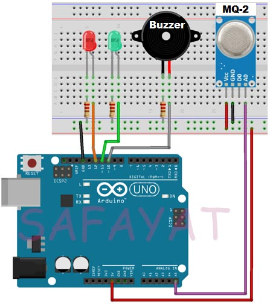

# smoke detector
# Introduction :
Detecting gas or smoke is necessary as it helps us to take necessary steps before any unexpected accidents such as building fire,suffocation or an explosion. Using MQ-2 gas sensor Methane, Butane, LPG and Smoke can be detected.
# Principle of Gas Sensor : 
The outputs of the sensor changes accordingly to the smoke/gas level that exists in the atmosphere which is proportional to the concentration of smoke/gas. 
# Apparatus : 
* Arduino Uno
* MQ-2 Gas sensor
* LEDS
* Buzzer 
* Resistors (220 ohms)
* Jumper Wires
# Schematics : 

# Code : 
[Code Link](Smoke_detector.ino)
# Application : 
Industrial or Household area where building fire,suffocation or an explosion can be happen due to unexpected gas leakage .